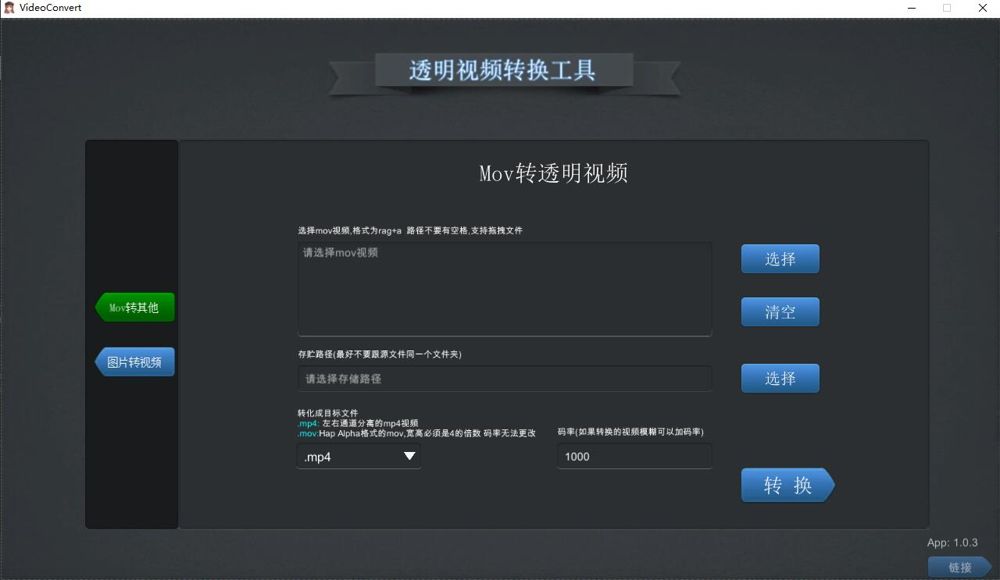

# unity 透明视频制作

&nbsp;

---

### 原理

使用[ffmpeg](http://ffmpeg.org/)命令转换,将ffmpeg 放在StreamingAssets文件夹中传入相应的指令启动

### 用到的其他插件
* 文件浏览插件
    [UnityStandaloneFileBrowser](https://github.com/gkngkc/UnityStandaloneFileBrowser)
* 拖拽插件
    [UnityWindowsFileDrag-Drop](https://github.com/Bunny83/UnityWindowsFileDrag-Drop)

   :heart: :heart: :heart: :heart: :heart:

## Change Log

**1.0.3**

​	增加mov `chunk 4`选项,减小包体

**1.0.2** 

​	修复拖入bug